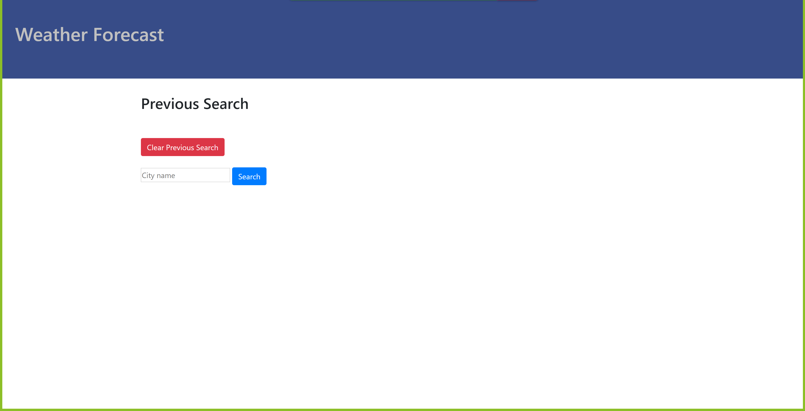

## Author:  Adeola Afariogun

# Project: Portfolio

#### Technology: HTML, CSS, Javascript, JQuery.

### Deployment URL: [link to My Portfolio!](https://adeola55.github.io/homework06/)

# 06 Weather App
i created an application that works in the browser. it displays the weather of any city searched and it also displays 5 more days weather of the city chosen.

# how weather is generated.
USer has to put in any city of chioce and then prompted to click the search button. this then displ;ays the current weather of the day the use is and then 5 more days of weather information is displayed also.

# screenshot of webpage  